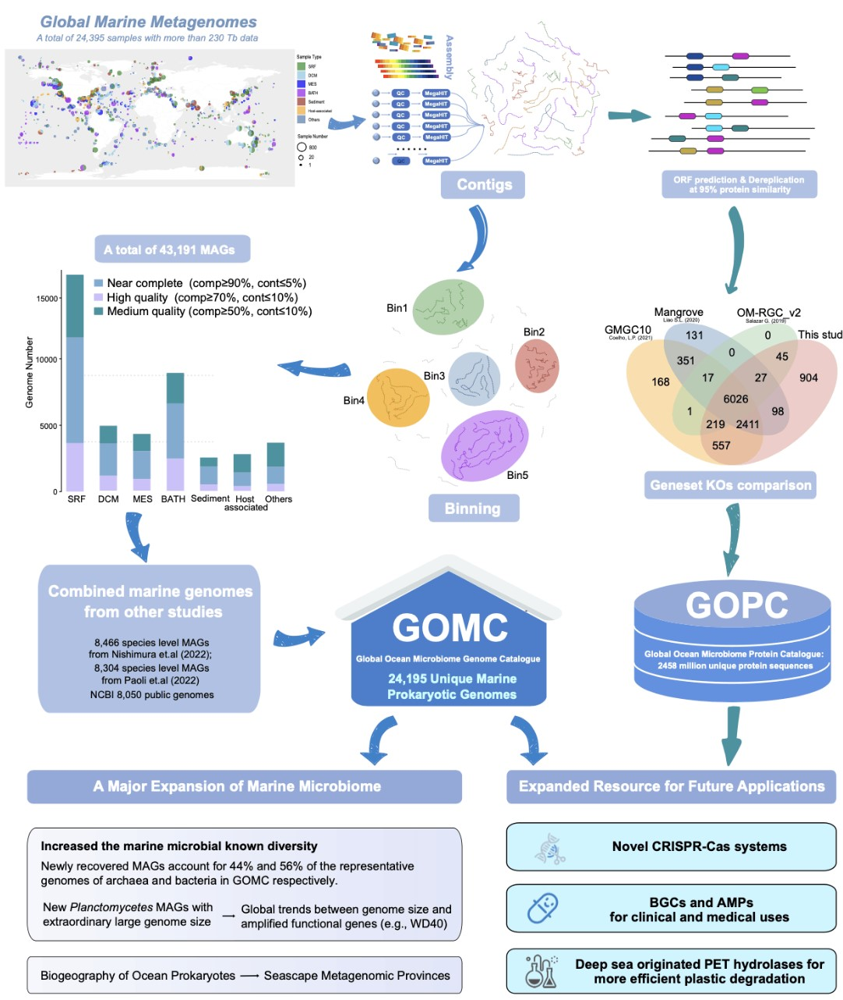

## Novel Enzyme Mining from Marine Microbiome Project

> Note: Please refer to `1.info.md` for common project guidelines, grading criteria, and submission requirements.

### Overview

*Figure 1: Overview of the marine enzyme mining framework, showing the integration of metagenomic sequencing, homology modeling, functional annotation, and machine learning-based enzyme activity prediction.*

### Introduction
- **Background**: Marine microorganisms represent a vast and largely untapped resource for novel enzyme discovery. The extreme conditions of marine environments (high pressure, low temperature, high salinity) have led to the evolution of enzymes with unique properties that are highly valuable for industrial applications. These biocatalysts offer significant advantages including high efficiency, substrate specificity, and reduced environmental impact. However, only a small fraction of marine microorganisms can be cultured in laboratory conditions, and traditional enzyme screening approaches are time-consuming and resource-intensive. Computational approaches for mining novel enzymes from marine metagenomic data provide a promising alternative to accelerate the discovery of industrially valuable biocatalysts.

- **Learning Objectives**:
  - Master metagenomic data analysis techniques
  - Understand enzyme function prediction from sequence information
  - Learn structural homology modeling for enzyme characterization
  - Integrate sequence, structural, and environmental information in enzyme activity prediction

### Problem Statement
- **Technical Description**: Develop computational methods to identify and characterize novel enzymes from marine microbiome metagenomic data, with a focus on predicting enzyme activity and substrate specificity.
- **Mathematical Definition**:
  - **Stage 1: Sequence Analysis and Homology Modeling**
    - Input: S ∈ Σ^n where
      - Σ: amino acid alphabet
      - n: sequence length
    - Outputs: 
      - X ∈ ℝ^d: Protein sequence feature vector
      - M ∈ ℝ^(3×n): 3D structural model
    - Learning Task: Enzyme family classification and structural prediction
    - Example Objective Function: min_θ L_feat = L_class + λL_structure

  - **Stage 2: Enzyme Activity and Specificity Prediction**
    - Input: G = (V, E) where
      - V: nodes representing amino acids with features
      - E: edges representing spatial proximity between amino acids
    - Output: y ∈ ℝ or y ∈ {0,1,...,k}: Activity level or substrate class
    - Learning Task: Graph-based regression or classification
    - Example Objective Function: min_φ L_pred = L_MSE(y, f(G;φ)) or L_CE(y, f(G;φ))
- **Key Challenges**:
  - Handling large and noisy metagenomic datasets
  - Accurate prediction of enzyme function from sequence
  - Limited availability of experimentally validated marine enzymes
  - Integrating environmental context into prediction models
- **Expected Outcomes**: 
  - Novel enzyme identification pipeline
  - Understanding of key structural features determining enzyme activity
  - Practical tools for industrial enzyme engineering and optimization

### Data Description
- **Provided Datasets**:
  - MarineEnz database: Contains metagenomic sequences from deep-sea environments
  - TARA Oceans dataset: Global ocean microbiome metagenomic data
  - EnzymeDB: Curated dataset of characterized marine enzymes
- **Additional Data Sources**:
  - UniProt/UniRef databases for protein sequence information
  - PDB database for structural templates
  - CAZy database for carbohydrate-active enzymes
- **Variables**:
  - Metagenomic sequence reads
  - Assembled contigs and ORFs
  - Environmental metadata (temperature, depth, salinity)
  - Structural features and active site information
- **Sample Size**: Varies by dataset (MarineEnz: ~100,000 potential enzyme sequences)
- **Datasets Name**: marine_enzyme_data.zip

### Methodology
- **Suggested Methods**:
  - Metagenomic sequence assembly and ORF prediction
  - Sequence-based enzyme family classification (suggested: HMM profiles, BLAST)
  - Structural homology modeling (suggested: AlphaFold, I-TASSER)
  - Active site identification and characterization
  - Machine learning for enzyme activity prediction (suggested: GNNs, attention mechanisms)
- **Implementation Guidelines**:
  - Use provided Python notebook template
  - Document preprocessing decisions
  - Compare multiple modeling approaches (sequence-only vs. structure-aware)
  - Implement feature selection methods
  - Validate predictions experimentally where possible

### Evaluation
- **Suggested Metrics**:
  - Classification Performance:
    - Precision, Recall, F1 score
    - Area under ROC curve (AUC)
    - Confusion matrix
  - Regression Performance:
    - Pearson correlation coefficient (R²)
    - Mean squared error (MSE)
    - Root mean squared error (RMSE)
- **Validation**: 
  - Five-fold cross-validation
  - Independent test set evaluation
  - Comparison with existing methods (EnzDP, DEEPre, ECPred)

### Resources
- **Papers**:
  - [Marine metagenome as a resource for novel enzymes](https://doi.org/10.1007/s10142-015-0431-6)
  - [Graph convolutional networks for computational drug development and discovery](https://doi.org/10.1093/bib/bbaa297)
  - [AlphaFold2: Highly accurate protein structure prediction with atomic accuracy](https://doi.org/10.1038/s41586-021-03819-2)
- **Code**: Example implementation
- **Tools**: PyTorch, PyTorch Geometric, BioPython, HMMER, BLAST, AlphaFold, scikit-learn

### Contact Information
- Hongyu Duan (dhy.scut@outlook.com) 
